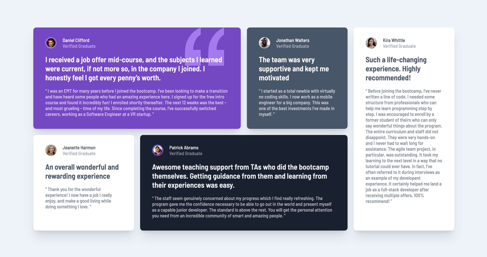

# Frontend Mentor - Testimonials grid section solution

This is a solution to the [Testimonials grid section challenge on Frontend Mentor](https://www.frontendmentor.io/challenges/testimonials-grid-section-Nnw6J7Un7). Frontend Mentor challenges help you improve your coding skills by building realistic projects.

## Table of contents

- [Overview](#overview)
  - [The challenge](#the-challenge)
  - [Screenshot](#screenshot)
  - [Links](#links)
- [My process](#my-process)
  - [Built with](#built-with)
  - [What I learned](#what-i-learned)
  - [Continued development](#continued-development)
  - [Useful resources](#useful-resources)
- [Author](#author)

## Overview

### The challenge

Users should be able to:

- View the optimal layout for the site depending on their device's screen size

### Screenshot



### Links

- Solution URL: [Github](https://github.com/graficdoctor/fe-19-testimonials-grid-section-main)
- Live Site URL: [Vercel](https://fe-19-testimonials-grid-section-main.vercel.app/)

## My process

### Built with

- Semantic HTML5 markup
- CSS custom properties
- Flexbox
- CSS Grid
- Mobile-first workflow

### What I learned

This is the first time I used `:nth-child()`. I totally see the benefit of using it in this excercise.

```css
article:nth-child(1) .social-avatar {
  border: 3px solid var(--clr-accent-200);
}
```

### Continued development

Learn more grid. Learn about using utility-classes as that seems a thing now.

### Useful resources

- [Learn CSS Grid The Easy Way - Kevin Powell](https://www.youtube.com/watch?v=rg7Fvvl3taU) - I watched his tutorial before I got started, to understand better how grid works and how to work with grid-template-areas. I also took some inspiration in how he sets up his css-file. Though I also thought it was important to keep writing code the way I do now, before going totally in this idea of 'utilities' and 'variables'.
- [Modern Container - Kevin Powell](https://twitter.com/KevinJPowell/status/1501555193799925761) - Another Kevin Powell-resource. This for setting up the `.container`.

## Author

- Frontend Mentor - [@graficdoctor](https://www.frontendmentor.io/profile/graficdoctor)
- Twitter - [@graficdoctor](https://www.twitter.com/graficdoctor)
